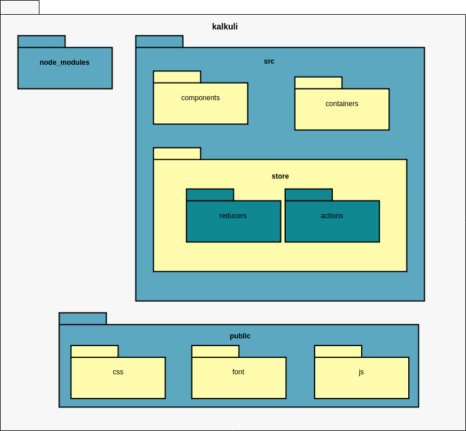
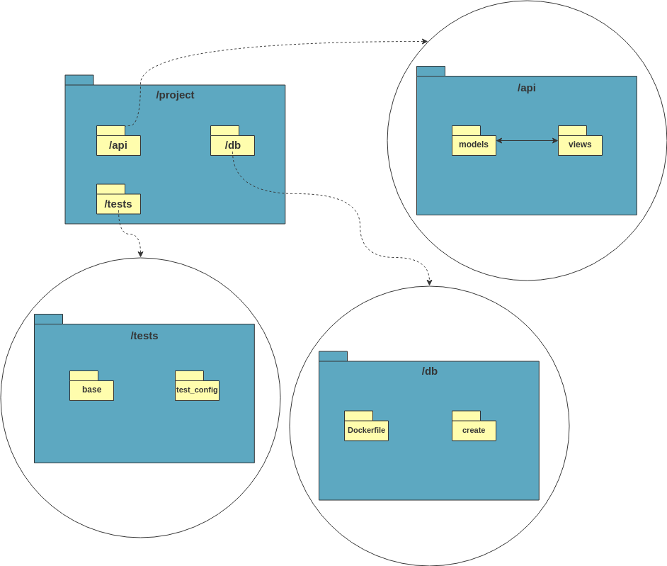
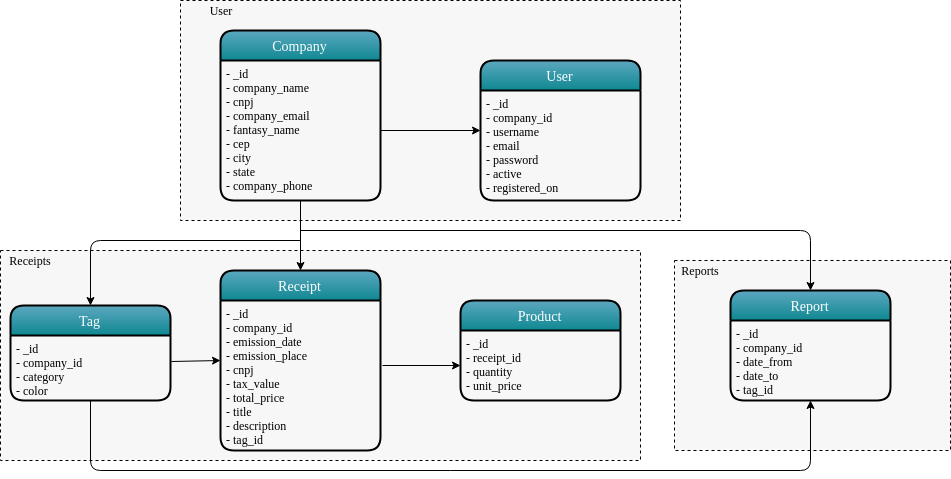
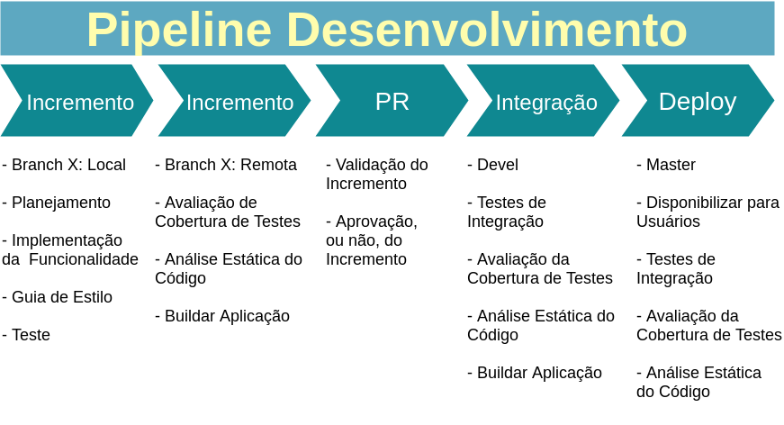

***

## Histórico de Revisão

|Data| Versão |Modificação|Autor|
|:---:|:---:|:---:|:--:|
| 04/09/2018 |   0.1  | Tópicos: 1.1, 1.2, 1.3, 1.4, 1.5| Lucas Dutra e Saleh Nazih |
| 06/09/2018 |   0.2  | Tópicos: 3, 4.1| Saleh Nazih |
| 07/09/2018 |   0.3  | Tópicos: 2| Lucas Dutra | 
| 07/09/2018 |   0.3.1  | Tópico: 1.4| Lucas Dutra e Saleh Nazih |
| 08/09/2018 |   1.0  | Tópicos: 4.2, 2.1, 2.2| Lucas Dutra e Saleh Nazih |
| 23/09/2018 |   1.1 | Tópicos: 1.1, 1.2, 1.3, 2.2| Ésio Freitas e Lucas Dutra |
| 24/09/2018 |   1.2 | Tópicos: 3, 4.1 e 4.2| Lucas Dutra |
| 25/09/2018 |   1.3 | Tópicos: 1.2, 2, 4.2, 4.5 e 5 | Ésio Gustavo |

## 1. Introdução

### 1.1 Finalidade

&emsp;&emsp;A intenção desse documento é capturar e transmitir as decisões significativas que foram tomadas em relação ao sistema do ponto de vista do arquiteto. Por isso, ele contém uma apresentação geral da arquitetura utilizada no projeto Kalkuli e explicita como acontecerá a comunicação dos diversos serviços contidos no software como um todo.

### 1.2 Escopo

&emsp;&emsp;O Kalkuli será uma aplicação responsável por escanear DANFCE, com o intuito de extrair, tratar e exibir dados de uma maneira simples e intuitiva para o usuário.

### 1.3 Definições, Acrônimos e Abreviações

* DANFCE - Documento auxiliar de notas fiscais do consumidar eletrônica
* WSGI - <i>Web Server Gateway Interface</i>

### 1.4 Referências

>Universidade Federal do Paraná, FUNPAR. RUP - Especificação de Casos de Uso: Template base para construção do documento de arquitetura. Disponível em: <a href="https://goo.gl/gDTkMx"><https://goo.gl/gDTkMx></a>. Acesso em: 2 de setembro de 2018.

>Microsserviços em poucas palavras. ThoughtWorks. Disponível em: <a href="https://goo.gl/AQNy6p"><https://goo.gl/AQNy6p></a>. Acesso em: 7 de setembro de 2018.

>Rocha, B. C. What the Flask? Pt-1 Introdução ao desenvolvimento web com Python. PythonClub. Disponível em: <a href="https://goo.gl/SfqDYX"><https://goo.gl/SfqDYX></a>. Acesso em: 7 de setembro de 2018.

>Tutorial: Intro to React. What is React?. ReactJs. Disponível em: <a href="https://goo.gl/9CCQXK"><https://goo.gl/9CCQXK></a>. Acesso em: 7 de setembro de 2018.

>Read Me. Redux. Disponível em: <a hre="https://goo.gl/SgQiKb"><https://goo.gl/SgQiKb></a>. Acesso em: 7 de setembro de 2018 

## 2. Representação da Arquitetura
* **React.js**      

&emsp;&emsp;<i>React</i> é uma biblioteca de <i>JavaScript</i> flexível, declarativa e eficiente para construção de interfaces para exibição ao usuário. O <i>React</i> permite a criação desde interfaces complexas até pequenos e isolados pedaços de código chamados “Componentes”.
 

* **Redux**     

&emsp;&emsp;<i>Redux</i> é um contêiner de estado preditivo para aplicações <i>JavaScript</i>. Ele ajuda a escrever aplicações que se comportam de forma constante,ou seja, que possui um processo claro e definido, de como sua aplicação pode mudar, em diferentes ecossistemas, e são facilmente testáveis.

* **Flask**        

&emsp;&emsp;<i>Flask</i> é um micro-<i>framework</i> de <i>python</i>, possui toda a flexibilidade da linguagem <i>python</i> e provê um modelo simples para desenvolvimento <i>web</i>. É baseado em 3 pilares: <i>Werkzeug</i>, uma biblioteca para desenvolvimento de <i>apps</i> WSGI, Jinja2, um <i>template engine</i> escrito em <i>Python</i> e <i>good intentions</i>, que são alta qualidade na legibilidade, liberdade de estruturar o <i>app</i> na maneira que desejar, entre outros aspectos.

* **Microsserviços**   

&emsp;&emsp;A arquitetura de microsserviços é uma abordagem que desmembra uma aplicação única em blocos de pequenos serviços independentes. Esses serviços executam o seu próprio processo e se comunicam, muitas vezes, por meio de métodos HTTP.

&emsp;&emsp;No <i>software</i> descrito neste documento a arquitetura de microsserviços será bastante utilizada. Os módulos serão:
<ul>
  <li><b>Extração de texto</b>, bloco responsável somente pela extração do texto proveniente das notas fiscais escaneadas;</li> 
  <li><b>Interpretação</b>, responsável pelo tratamento dos dados brutos que foram extraídos das notas; </li>
  <li><b>Tags</b>, responsável por toda organização de etiquetas que o usuário vai atribuir a cada nota escaneada; </li>
  <li><b>Exportação</b>, responsável por exportar os relatórios e as notas escaneadas pelo usuário para a extensão desejada;</li>
  <li><b>Relatórios</b>, responsável por usar os dados provenientes das notas para gerar relatórios de gastos, entre outros; </li>
  <li><b>Usuário</b>, bloco responsável por toda interação do usuário, como login, registro; </li>
  <li><b>Notas</b>,  será um serviço responsável por gerenciar todas as notas fiscais extraídas.</li>
  <li><b>Gateway</b>, serviço responsável por intermediar a comunicação entre o Back-end e o Front-end.</li>
</ul>

### 2.1 Representação arquitetural

### 2.2 Diagrama React-Redux

## 3. Metas e Restrições de Arquitetura

&emsp;&emsp;A aplicação deverá ser suportada pelos navegadores, <i>Mozilla Firefox</i>, <i>Google Chrome</i>, Opera e <i>Microsoft Edge</i>. Toda parte do <i>front-end</i> será construída utilizando <i>React.js</i>, biblioteca de JavaScript para criar interfaces para o usuário, juntamente com <i>Redux</i>, um contêiner de estado preditivo para aplicações <i>JavaScript</i> . A aplicação também utilizará do <i>microframework</i> <i>Flask</i>, que é construído em <i>python</i> e que juntamente com a biblioteca PyTesseract realizarão a extração de dados das notas.

&emsp;&emsp;Além disso, a ferramenta <i>Docker</i> será utilizada para facilitar o desenvolvimento em um ambiente isolado e construído especialmente para a equipe.

## 4. Visão de Implementação

### 4.1 Visão Geral

&emsp;&emsp;A aplicação se baseará na arquitetura de microsserviços. Com cada serviço executando pequenas tarefas, requisitando ou processando dados. O importante dessa arquitetura é a sua implementação mais rápida e de fácil manutenção.

### 4.2 Pacotes de Design Significativos do Ponto de Vista da Arquitetura

* Front-End

&emsp;&emsp;O <i>front-end</i> será inteiramente construído com a biblioteca <i>React</i>, segue a estrutura de pacotes da aplicação:

* Back-End

&emsp;&emsp;O <i>back-end</i> será inteiramente construído com o <i>microframework</i> <i>Flask</i>, segue a estrutura de pacotes da aplicação:

### 4.3 Modelagem de Dados

## 5. Visão de Implantação

A implantação do produto será realizada por etapas. Todas devem visar que cada incremento de produto agregre maior valor ao cliente com maior qualidade possível, como podemos observar no pipeline abaixo: 

