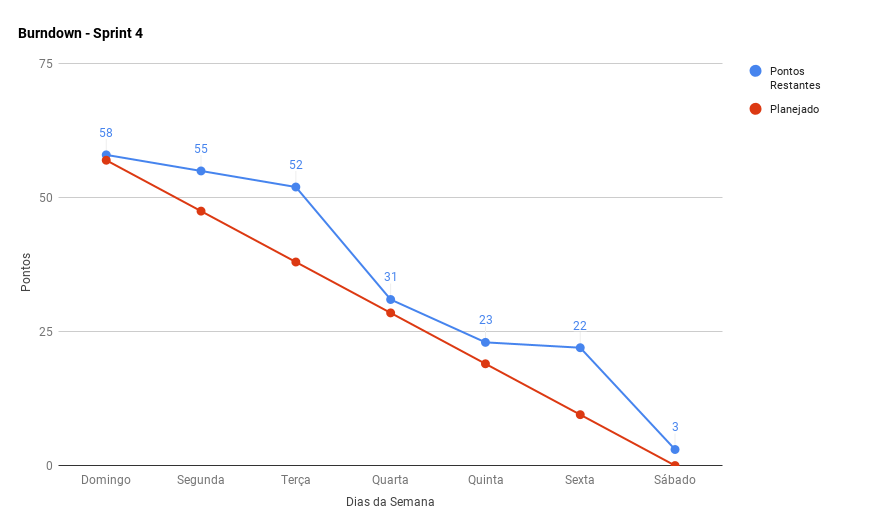
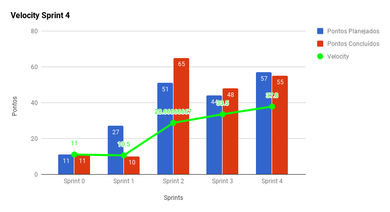

***       

<i>Sprint</i> que simboliza a busca do aumento de qualidade através da adição de integrações contínuas e ambientes de testes em todos os repositórios, como também a entrega do <i>core</i> da aplicação, a intepretação dos dados de notas fiscais.

## Fechamento da _Sprint_   

|     _Issue_      |     _Status_    |       Pontos       |
|:--------------:|:---------------:|:-------------:
|[US13 - Listar notas fiscais ](https://github.com/fga-eps-mds/2018.2-Kalkuli/issues/72) |Concluída | 8 |
|[US17 - Interpretar dados de notas fiscais ](https://github.com/fga-eps-mds/2018.2-Kalkuli/issues/73) |Concluída | 21 |
|[US32 - Armazenar notas fiscais no sistema ](https://github.com/fga-eps-mds/2018.2-Kalkuli/issues/74) |Concluída | 8 |
|[Configurar o _Code Climate_ ](https://github.com/fga-eps-mds/2018.2-Kalkuli/issues/75) |Concluída | 3 |
|[Configurar as Integrações Contínuas ](https://github.com/fga-eps-mds/2018.2-Kalkuli/issues/76) |Concluída | 5 |
|[Refatorar EAP ](https://github.com/fga-eps-mds/2018.2-Kalkuli/issues/77) |Concluída | 3 |
|[Elaborar a Matriz de Avaliação de Valor ](https://github.com/fga-eps-mds/2018.2-Kalkuli/issues/78) |Não Concluída | 3 |

Pontos Planejados Concluídos: 54    
Pontos de Dívida Concluídos:  1   
Pontos Não Agregados: 3 

> [_Milestone Sprint_ 4](https://github.com/fga-eps-mds/2018.2-Kalkuli/milestone/5?closed=1)

## _Burndown_    

O <i>burndown</i> indica que as <i>issues</i> entregues tinham pontuações altas, representando alta complexidade e valor para o produto. 

 
Foi apontado na retrospectiva da <i>sprint</i> anterior, que as histórias foram começadas tardiamente. Nesta <i>sprint</i> esperava-se que as entregas começassem a partir de terça-feira, dado que toda a  <a href="https://github.com/fga-eps-mds/2018.2-Kalkuli/issues/29#issuecomment-420445456" title="Quadro de Provas de Integrantes da Equipe">equipe de desenvolvimento teria provas</a> nesta data. A equipe de EPS também teria provas na semana da <i>sprint</i>, contudo, foi capaz de entregar suas <i>issues</i> porque as começou com antecedência.

## _Velocity_     

A pontuação planejada em relação à <i>sprint</i> anterior aumentou, evidenciando a busca pela produtividade máxima.

O empenho e a capacidade da equipe em finalizar as <i>issues</i> repercute a incidência de poucas dívidas, e resulta no aumento gradual da pontuação da <i>sprint</i>.

   

## Riscos    

Dois novos riscos foram identificados durante a <i>sprint</i>:

<ul>
<li>Trancamento de discplina por integrante da equipe;</li>
<li><a href="https://www.metropoles.com/distrito-federal/transporte-df/no-df-semana-comeca-com-ameaca-de-greve-em-onibus-e-no-metro" title="No DF, semana começa com ameaça de greve em ônibus e no metrô;">Greve no transporte público; </a>  </li>
</ul>

 

Durante a <i>sprint</i>, a probabilidade de uma possível greve no transporte público prejudicar a equipe é baixa, pois a semana da <i>sprint</i> coincide com a semana universitária, semana que a maioria dos integrantes não têm aula, portanto, não afetará as dailies tampouco os pareamentos.

 

## Retrospectiva

Retrospectiva apontou a redução de pontos negativos em relação a <a href="https://fga-eps-mds.github.io/2018.2-Kalkuli/docs/rsprint3#retrospectiva" title="Retrospectiva Sprint 3"><i>sprint</i> anterior</a>. Também transpareceu o bom relacionamento entre EPS e a fluidez na execução das tarefas de cada papel.

   

   

### _Sprint_ Anterior

Com relação aos pontos negativos apresentados na retrospectiva anterior, algumas medidas foram tomadas para que não se mostrassem novamente, são eles:

<table>
  <tr align="center">
    <th>Ponto Negativo</th>
    <th>Correção Adotada</th>
  </tr>
  <tr>
    <td>
      <ul style="list-style-type:circle">
        <li>Problemas no planejamento da execução da história (pareamento)</li>  
        <li>Ausência de membro</li>
      </ul>
    </td>
    <td>
      
Estes pontos negativos simbolizam a sobrecarga de um membro da dupla de pareamento, que com a ausência do parceiro, concluiu a história sozinho.

      
A medida preventiva adotada para a <i>sprint</i> corrente, foi a adoção de um <i>superpairing</i>, uma vez que se este membro se ausentasse novamente, não haveria sobrecarga em uma pessoa, e uma dupla seria capaz de finalizar a história.
</td>
  </tr>
  <tr>
    <td>
      <ul style="list-style-type:circle">
        <li>Dailies por hangouts (horários e atrasos)</li>  
      </ul>
    </td>
    <td>
Buscando a participação de toda a equipe nas <i>dailies</i> de segunda e sexta, o horário da <i>daily</i> de sexta sofreu alteração para 20h45.
</td>
  </tr>
</table>

### Quadro de Conhecimento   

Houve uma leve melhora em algumas das tecnologias por parte de MDS, visto que estão em contato constante com as mesmas, entretanto, por ainda ser o começo do projeto e do uso das tecnologias, não esperava-se um salto notável.

### Registros de Presença nas _Dailies_    

<i>Dailies</i> de segunda e sexta feira são feitas por <i>hangouts</i>, às 21h30 e 20h45, respectivamente.

| Nome    |Segunda Feira      | Terça Feira      | Quarta Feira     | Quinta Feira      | Sexta Feira      |     
|:-----:  |:-----------------:|:----------------:|:----------------:|:-----------------:|:----------------:|
|Bernardo |         ✔         |         ✔        |         ✘        |         ✔         |         ✔        |
|Clarissa |         ✔         |         ✔        |         ✔        |         ✔         |         ✔        |
|Esio     |         ✔         |         ✔        |         ✔        |         ✔         |         ✔        |
|Felipe   |         ✔         |         ✔        |         ✔        |         ✔         |         ✔        |
|Jacó     |         ✔         |         ✔        |         ✘        |         ✔         |         ✔        |
|Lucas    |         ✔         |         ✔        |         ✔        |         ✔         |         ✘        |
|Mariana  |         ✔         |         ✘        |         ✔        |         ✔         |         ✔        |
|Pedro    |         ✔         |         ✔        |         ✔        |         ✔         |         ✔        |
|Saleh    |         ✔         |         ✔        |         ✔        |         ✔         |         ✔        |
|Youssef  |         ✘         |         ✔        |         ✔        |         ✔         |         ✔        |      

## Avaliação do _Scrum Master_  

A capacidade técnica e motivação da equipe fica evidente numa <i>sprint</i> que, ainda com afazeres de outras disciplinas, se mostrou capaz de entregar praticamente todas as <i>issues</i> planejadas, incluindo o cerne da aplicação, que possui prioridade e complexidade altas.

A qualidade das entregas das histórias de usuário ficam evidentes, já que todas foram testadas, assegurando a cobertura de todos os serviços a que as histórias pertencem. Já respeitam os critérios de pronto para a  <a href="https://fga-eps-mds.github.io/2018.2-Kalkuli/docs/defpronto#release-ii" title="Definição de Pronto"><i>release</i> II</a>, onde todas as histórias deverão, obrigatoriamente, ser testadas. Isso reflete o empenho e a capacidade técnica elevada da equipe de desenvolvimento, e permite planejamentos maiores e mais refinados, visando produtividade máxima.

As duplas de pareamento foram montadas de forma diferente da <i>sprint</i> anterior. Em sua definição, o objetivo foi de balancear o nível de conhecimento, favorecendo o aprendizado, com um integrante que teve contato com uma tecnologia na <i>sprint</i> anterior, e outro que não. Também nessa <i>sprint</i>, houve o primeiro pareamento entre EPS e MDS. A decisão foi tomada, pois a <i>issue</i> é de importância muito alta para o produto, e favorece a troca de conhecimento entre um membro experiente e outro menos experiente.

O risco de requisitos com alto nível de complexidade se mostrou na retrospectiva: "muitas atividades para apenas uma <i>issue</i>". Causou confusão na equipe de MDS, pois não sabiam onde começavam e onde terminavam as obrigações da história, dificultando a criação de <i>tasks</i> de histórias tecnicamente mais complexas que as da <i>sprint</i> anterior. EPS percebeu a falha na granularidade das histórias, e como resposta ao risco, buscando sua mitigação, no <i>sprint planning</i> a equipe revisará as histórias escolhidas, buscando a possibilidade de granularização destas. Também <i>Product Owner</i> e <i>Scrum Master</i> revisarão o <i>backlog</i> do produto, buscando possíveis histórias passíveis de redução.

O risco de dificuldade com tecnologias ainda é alto, porém sua redução a cada <i>sprint</i> fica evidente, visto que o contato com as tecnologias aumenta a cada <i>sprint</i>, e sua redução também é resultado dos treinamentos de qualidade dados no começo do projeto.

Falhas como atrasos em <i>dailies</i> e falta de clareza ao especificar atividades das histórias aconteceram durante a <i>sprint</i>, e são pontos constantes de busca de adaptação e melhora.

O final da <i>sprint</i> 4 evidencia a relação harmoniosa entre EPS, que, fazendo um trabalho competente, reflete o aumento de motivação e conhecimento por parte de MDS, que, por sua vez, faz entregas de qualidade cada vez maior, solidificando a confiança da equipe como um todo.

