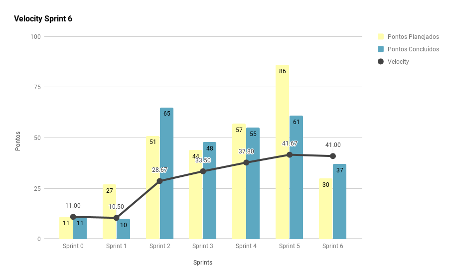
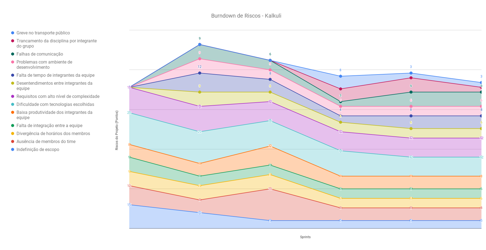

***    

<i>Sprint</i> que contempla a ocorrência da primeira <i>release</i>. Revela o alcance da produtividade máxima da equipe, e consolida a primeira versão funcional do <i>software</i>.

## Fechamento da _Sprint_   

|     _Issue_      |     _Status_    |       Pontos       |
|:--------------:|:---------------:|:-------------:|
|[Criar a Release do Projeto](https://github.com/fga-eps-mds/2018.2-Kalkuli/issues/125) |Concluída | 0 |
|[Complementar Documento de Arquitetura](https://github.com/fga-eps-mds/2018.2-Kalkuli/issues/122) |Concluída | 1 |
|[Evoluir US10](https://github.com/fga-eps-mds/2018.2-Kalkuli/issues/119) |Concluída | 2 |
|[Evoluir Identidade Visual](https://github.com/fga-eps-mds/2018.2-Kalkuli/issues/121) |Concluída | 3 |
|[US34 - Acessar Pagina Principal](https://github.com/fga-eps-mds/2018.2-Kalkuli/issues/105) |Concluída | 5 |
|[Organizar Resultados da Elicitação de Requisitos](https://github.com/fga-eps-mds/2018.2-Kalkuli/issues/102) |Concluída | 5 |
|[Adicionar _Deploy_ Contínuo ](https://github.com/fga-eps-mds/2018.2-Kalkuli/issues/97) |Concluída | 21 |
|[Evoluir US 20](https://github.com/fga-eps-mds/2018.2-Kalkuli/issues/120) |Não Concluída | 1 |
|[Evoluir TAP](https://github.com/fga-eps-mds/2018.2-Kalkuli/issues/123) |Não Concluída | 2 |
|[Criar o EVM](https://github.com/fga-eps-mds/2018.2-Kalkuli/issues/124) |Não Concluída | 8 |
|[US33 - Gerar Relatório por Período Definido](https://github.com/fga-eps-mds/2018.2-Kalkuli/issues/126) |Não Concluída | 13 |   

Pontos Planejados Concluídos: 6    
Pontos de Dívida Concluídos:  31   
Pontos Não Agregados: 24  

> [_Milestone Sprint_ 6](https://github.com/fga-eps-mds/2018.2-Kalkuli/milestone/7?closed=1)

## _Burndown_    

<i>Sprint</i> com poucos pontos planejados, em razão da ocorrência de dívidas técnicas oriundas da 
<a href="https://fga-eps-mds.github.io/2018.2-Kalkuli/docs/rsprint5#fechamento-da-sprint" title="Fechamento da Sprint 5"><i>sprint</i> anterior</a>. Também poucos pontos planejados para refino dos artefatos e correção de algumas das histórias de usuário concretizadas até o momento, para apresentação na <a href="https://fga-eps-mds.github.io/2018.2-Kalkuli/docs/release" title="Kalkuli, Apresentação Release I"><i>release</i></a>.

 

A <i>release</i> ocorreria na quinta-feira (04/10), portanto, esperava-se que as <i>issues</i> fossem entregues um dia antes. É possível perceber a entrega antecipada, dado que a equipe começou o trabalho logo após o planejamento da <i>sprint</i>.

 

## _Velocity_     

O <i>velocity</i> se mantém estável, visto que poucos pontos foram planejados. A pontuação, em sua maioria, contemplava dívidas técnicas, portanto, esperava-se que a pontuação concluída fosse acima da pontuação planejada.

   

## Riscos    

Não foram identificados riscos novos no decorrer da <i>sprint</i>. 

Um dos riscos mapeados se mostrou, dado que um membro da equipe de desenvolvimento trancou a disciplina.

  

 

## Retrospectiva

A equipe continua apresentando poucos pontos negativos na retrospectiva. Os pontos negativos expostos nesta <i>sprint</i> são inferiores aos apontados na <a href="https://fga-eps-mds.github.io/2018.2-Kalkuli/docs/rsprint5#retrospectiva" title="Retrospectiva Sprint 5">anterior</a>, entretanto são diferentes, dado o contexto atípico no qual a <i>sprint</i> ocorreu (<i>release</i> I).

   

   

### _Sprint_ Anterior

Com relação aos pontos negativos apresentados na retrospectiva anterior, algumas medidas foram tomadas para que não se mostrassem novamente, são eles:

<table>
  <tr align="center">
    <th>Ponto Negativo</th>
    <th>Correção Adotada</th>
  </tr>
  <tr>
    <td>Muitas atividades para apenas uma <i>issue</i> (EPS)</td>
    <td>Discutir a possibilidade de redução das <i>issues</i> planejadas relacionadas ao projeto, que são responsabilidade de EPS.</td>
  </tr>
</table>

### Quadro de Conhecimento   

A <a href="https://fga-eps-mds.github.io/2018.2-Kalkuli/docs/defpronto#release-ii" title="Definição de Pronto, Release II">definição de pronto</a> das histórias de usuário e técnicas sofre mudança para a <i>release</i> II, com a obrigatoriedade de testes sendo construídos, a coluna "testes" deu origem a duas novas: "testes <i>Flask</i>" e "testes <i>React</i>", facilitando o rastreio mais apurado das habilidades da equipe.

### Registros de Presença nas _Dailies_    

<i>Dailies</i> de segunda e sexta feira são feitas por <i>hangouts</i>, às 21h30.

<i>Dailies</i> de quarta-feira são feitas por <i>telegram</i>, às 12h.

| Nome    |Segunda Feira      | Terça Feira      | Quarta Feira     | Quinta Feira      | Sexta Feira      |     
|:-----:  |:-----------------:|:----------------:|:----------------:|:-----------------:|:----------------:|
|Bernardo |         ✔         |         ✔        |         ✘        |    _Release I_    |         ✔        |
|Clarissa |         ✔         |         ✔        |         ✔        |    _Release I_    |         ✔        |
|Esio     |         ✔         |         ✔        |         ✔        |    _Release I_    |         ✔        |
|Felipe   |         ✔         |         ✔        |         ✘        |    _Release I_    |         ✔        |
|Lucas    |         ✔         |         ✔        |         ✔        |    _Release I_    |         ✔        |
|Mariana  |         ✔         |         ✔        |         ✔        |    _Release I_    |         ✔        |
|Pedro    |         ✔         |         ✔        |         ✔        |    _Release I_    |         ✔        |
|Saleh    |         ✔         |         ✔        |         ✔        |    _Release I_    |         ✔        |
|Youssef  |         ✔         |         ✔        |         ✔        |    _Release I_    |         ✔        |      

## Avaliação do _Scrum Master_  

<i>Sprint</i> que representa o alcance da produtividade máxima da equipe. Foi marcada pelo cansaço evidente, inclusive apontado na retrospectiva, como "planejamento inferior" e "estresse pré R1". 

Apesar do contexto em que a <i>sprint</i> aconteceu, na semana da primeira <i>release</i>, é possível perceber que a capacidade de entrega da equipe se mantém, mesmo com o planejamento inferior ao usual, com carga alta e desbalanceada. Também é perceptível a incidência de dívidas técnicas acima do normal.

Durante a busca pelo ponto de produtividade ótima, após certo número de <i>sprints</i> com pontuações cada vez maiores, é natural não atingir o planejado. Ao perceber o ponto de falha, as próximas <i>sprints</i> estarão restritas aos valores reproduzidos pelo <i>velocity</i>.

O <i>velocity</i> atual corrobora o atingimento da produtividade máxima. O número de pontos ideal para as próximas <i>sprints</i> se torna cada vez mais evidente, dado que um aumento gradual na pontuação, já alta, possivelmente podem causar cansaço, estresse e consequentemente desmotivação na equipe.

Os riscos de maior incidência nas últimas <i>sprints</i>, de requisitos com alto nível de complexidade, e de dificuldade com tecnologias adotadas, não se mostraram durante a <i>sprint</i>. A equipe de desenvolvimento se mostrou madura e capaz de finalizar as histórias dirigidas à eles, com a incidência de uma dívida, que, por conta do planejamento falho, não foi finalizada a tempo.

Visando recuperação da equipe, a <i>sprint</i> 7 foi planejada de modo a quitar as dívidas técnicas, com baixo número de histórias novas planejadas, evitando sobrecarga, tanto em MDS como em EPS.

Apesar da <i>sprint</i> inferior ao usual, a equipe foi capaz de entregar parte do planejado, e constatar sua produtividade máxima. Também ficou evidente a harmonia e esforço do grupo, resultando numa apresentação bem sucedida, transparecendo o empenho e profissionalismo da equipe a fim de entregar um produto de qualidade.

