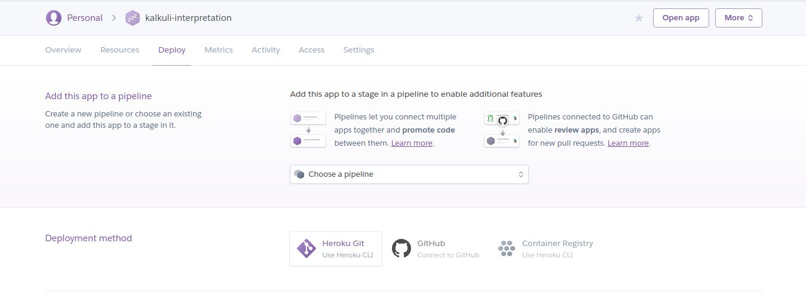
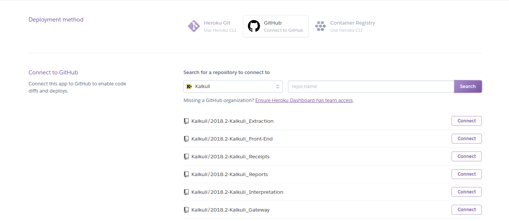

***   

## Introdução

O deploy do projeto é separado em três diferentes frentes, cada uma com suas necessidades especiais:

* Deploy de Microsserviços sem Banco de Dados
* Deploy de Microsserviços com Banco de Dados
* Deploy do Front-End

<br><br>

## 1. Microsserviços sem BD

O deploy dos microsserviços sem BD são realizados no AmazonAWS utilizando o [Zappa](https://github.com/Miserlou/Zappa). O zappa possibilita realizar implatação de aplicações python server-less. Siga os passos abaixo:

### 1.1 Crie um Virtual Environment

* Baixe o virtualenv
```
sudo apt install virtualenv
```

* Crie um virtualenv, fora do diretório do repositório, com o python 3.6
```
virtualenv -p python3.6 aws
```

* Entre no virtualenv
```
source aws/bin/activate
```

* Se assegure que a versão do python dentro do virtualenv é 3.6. <small><small> Caso não seja haverá problema de compatibilidade com o zappa. </small></small>
```
$ python --version
> Python 3.6.5
```

* Adicione a seguinte dependencia ao requirments.txt:
```
zappa==0.47.0
```

* Atualize o ambiente com o requirements do projeto
```
pip install -r requirements.txt
```
<br>

<small><small> Caso nesta etapa você receba o erro **"command 'x86_64-linux-gnu-gcc' failed with exit status 1"** durante a instação, saia do virtualenv e utilize o seguinte comando:  </small></small>

```
sudo apt-get install python3-dev
```
<small> Agora entre novamente no virtualenv, rode o comando anterior e continue.  </small>

<br>

### 1.2 Novo Deploy

* Inicialize o zappa:
```
zappa init
```

* Coloque o nome do seu ambiente, aqui assumiremos que será implantado o ambiente de produção:
```
prod
```

* Coloque o nome do seu bucket, no Kalkuli seguimos o padrão: "kalkuli-serviço-ambiente-bucket", considerando o serviço de exportação, utilizariamos o padrão:
```
kalkuli-export-prod-bucket
```

* Coloque o caminho onde se encontra a sua função de inicialização do App:
```
manage.app
```

* Depois será perguntado se o deploy precisa ser global, disponível em todos os servidores. No nosso caso, não necessitamos
```
n
```

* Depois será apresentado uma pré-visualização de um JSON com as configurações. Aceite.
```
y
```

* Será criado um arquivo zappa_settings.json similar a estes:
```
{
    "prod": {
        "app_function": "manage.app",
        "project_name": "2018-2-kalkuli-",
        "runtime": "python3.6",
        "s3_bucket": "kalkuli-gateway-prod-bucket"
    }
}
```

* Mude o nome do projeto. Não é aceito hifens, o nosso padrão é kalkuliServico.
```
"project_name": "kalkuliExport",
```

* Depois adicione a região onde o deploy será realizado. No nosso caso utilizamos South America 1.

```
"aws_region": "sa-east-1"
```

* O arquivo deve estar similar ao abaixo:
```
{
    "prod": {
        "app_function": "manage.app",
        "project_name": "kalkuliExport",
        "runtime": "python3.6",
        "s3_bucket": "kalkuli-export-prod-bucket",
        "aws_region": "sa-east-1"
    }
}
```

* Agora é só fazer o deploy!
```
zappa deploy prod
```

<br>

### 1.3 Atualizando Deploy

* Utilize o seguinte comando:
```
zappa update prod
```

Lembrando que 'prod' é referente ao ambiente apresentado nos passos anteriores, podendo variar de acordo com a configuração prévia.

<br>


### 1.4 Deploy Contínuo

* Adicione ao .travis.yml indicações para realizar o deploy:
```
after_success:
  - chmod +x ./deploy.sh
  - ./deploy.sh
``` 

* Depois crie um arquivo deploy.sh:
```
#!/bin/bash

set -e
set -u


if [ $TRAVIS_PULL_REQUEST = "false" -a $TRAVIS_BRANCH = "develop" ]
then
    echo "Deploy on homologation environment started"
    pip3 install zappa
    zappa update hom
    echo "Deploy on homologation environment finished"
    exit 0;
fi


if [ $TRAVIS_PULL_REQUEST = "false" -a $TRAVIS_BRANCH = "master" ]
then
    echo "Deploy on production environment started"
    pip3 install zappa
    zappa update prod
    echo "Deploy on production environment finished"
    exit 0;
fi


echo "Skipping deployment on branch=$TRAVIS_BRANCH, PR=$TRAVIS_PULL_REQUEST"
```

Repare que o deploy será feito nos hambientes de produção e homologação caso as atualizações caiam nas branchs master e develop, respectivamente.

<small> Note que se seu GitFlow for diferente, com branch com outros nomes, essas configurações não funcionarão </small>


## 2. Front End

### 2.1 Fazendo deploy

* Acesse a [dashboard do heroku](https://dashboard.heroku.com/apps). Clique em Create New App.


* Insira o nome do App e crie-o.

* Na página de visualização do app, clique em **Deploy**.

* Navegue até Deployment Method.



* Clique em Github, selecione a organização e depois o repositório que deseja implantar.




* Depois de conectar com o repoistório, faça o deploy da branch master.


<br>

### 2.2 Deploy Contínuo

* Vá novamente ao dashboard e crie uma pipeline.

* Com a pipeline criada, basta adicionar o app ao estágio desejado.


* Apps em produção devem ser adicionados ao estágio _Production_, e em homologação ao estágio _Staging_.

* Vá em _Deploy_ e configure a seção _Automatic Deploys_


## 3. Microsserviços com BD

### 3.1 Fazendo Deploy

* Vá no arquivo config.py e acrescente o ambiente desejado, supondo que seja o de produção, segue um exemplo:

```
class ProductionConfig(BaseConfig):
    SQLALCHEMY_DATABASE_URI = os.environ.get('DATABASE_URL')
```

* Crie um Procfile no diretório pricipal da aplicação, que é um arquivo de configuração do heroku.

```
web: gunicorn -b 0.0.0.0:$PORT manage:app
release: python manage.py recreatedb 
```

* Os ambientes devem ser listados no README, atualize-o.

* Acesse a Dashboard do Heroku e crie o app.

* Vá em _Settings_ e configure as variaveis de ambiente:


<small><small>**OBS:** Não configura **DATABASE_URL**, o heroku fará automaticamente.</small></small>

* Faça deploy da branch desejada.


### 3.2 Deploy Contínuo

* Siga os passos do deploy contínuo no front (seção 2.2).
