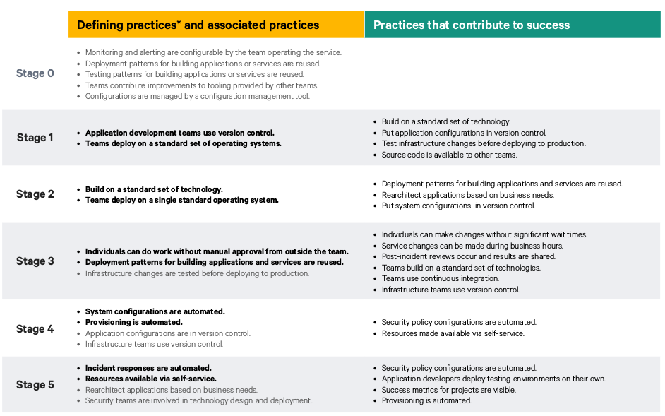

# Introdução

Puppet é uma empresa de TI voltada para a área de de infraestrutura de softwares. Possui como principal produto o Puppet Enterprise, software que lida com o ciclo de vida de infra. 

Também é responsável por realizar, anualmente, a maior pesquisa na áreas de DevOps do planeta. Em 2018 a pesquisa foi voltada para mapear os estágios de maturidade de empresas na área de DevOps, levantando práticas e atividades que devem ser realizadas para que um projeto atinja tal nível de maturidade.

Abaixo podemos observar o Modelo de Maturidade e as práticas relacionadas a cada uma das etapas. Note que as práticas em negrito são definidoras, ou seja, obrigatórias para um projeto se encontre neste nível de maturidade:

 
# 1. Estágio 0: Construa a Fundação

Os times integrantes do projeto (Desenvolvimento, DevOps, Testes e etc) estão começando a entender a importância da colaboração e padronização. Assim, são utilizadas tecnologias e processos que ajudem a compartilhar ideias, métricas e conhecimento.

### 1.1. Práticas Definidoras

Neste estágio inicial não há praticas definidoras, apenas associadas.

### 1.2 Práticas Associadas

- [ ] **Monitoramento e alerta são configuráveis pela equipe que opera o serviço.** Atualmente os sistemas de monitoramente e alerta não são configuráveis de acordo com as limitações do Heroku, plataforma que disponibiliza o ambiente de produção. 

- [X] **Reutilizar padrões de implantação para aplicações ou serviços de construção.** A implantação é padronizada de acordo com o [Guia de Deploy](deploy.md).

- [ ] **Reutilizar padrões de teste para construção aplicações ou serviços.** O time desenvolvimento procura utilizar testes realizado como base para a criação de novos testes, porém não existe um padrão definido para realização de testes.

- [X] **Equipes contribuem com melhorias para ferramentas fornecidas por outras equipes.** Não há equipes diferentes para que esta prática seja corretamente aplicada. Porém extendendo este conceito para pareamento, há contribuição de diferentes duplas para a mesma ferramenta.

- [X] **Configurações são gerenciadas por ferramentas de gerenciamento de configuração.** Docker é utilizado com este intuito.

 
# 2. Estágio 1: Simplifique a Pilha de Tecnologia

Neste nível os desenvolvedores já adotaram controle de versionamento e começaram a enxugar os seus sistemas para reduzir sua complexidade. Utilizar uma gama tecnologias diferentes para o mesmo objetivo demanda muito esforço, desacelerado os avanços do negócio, então nesta fase um padrão de tecnologias a ser utilizado deve ser definido.

### 1.1. Práticas Definidoras
- [X] **As equipes de desenvolvimento de aplicativos usam o controle de versão.** O Git e Github são utilizados com este intuito.

- [X] **Deploy realizado em um conjunto de sistemas operacionais padrão.** Não houve necessidade de realizar a implação em um conjunto de SOs diferentes, sendo realizado apenas em um, o Linux.

### 1.2 Práticas Associadas
Não há práticas associadas.

## Referências

>Puppet. State of DevOps Report 2018. Disponível em: <a href="https://puppet.com/resources/whitepaper/state-of-devops-report"><https://puppet.com/resources/whitepaper/state-of-devops-report></a>. Acesso em: 29 de outubro de 2018.